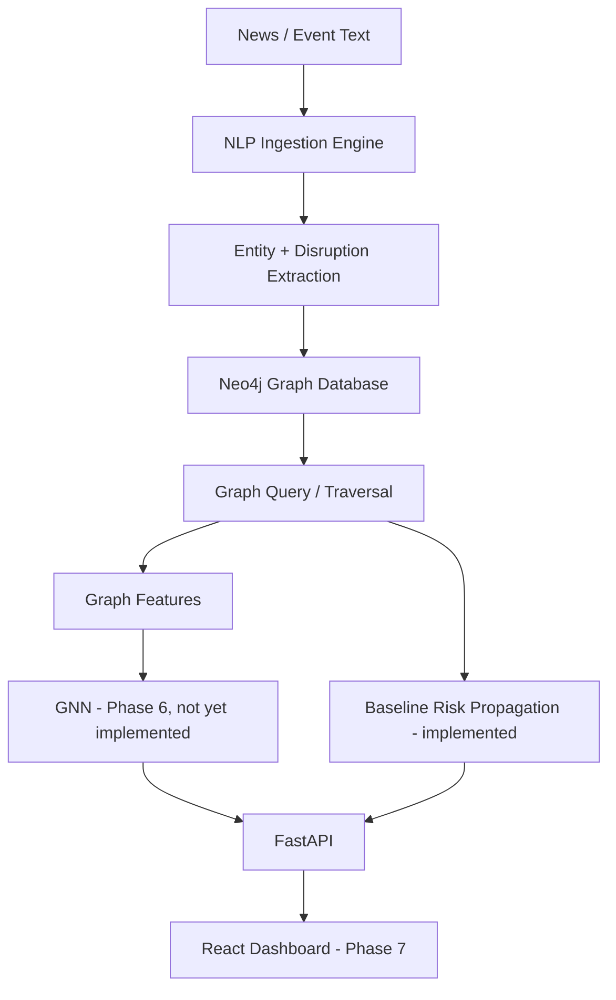

# AtmoGraph — Supply Chain Ripple Effect Predictor

**Status: PHASE 1-4 complete (backend foundation, Neo4j graph, baseline NLP,
FastAPI, baseline graph-based risk propagation). Phase 5 (GNN) not started.**

## 1. Project overview

AtmoGraph predicts how a disruption in one part of a global supply chain
(a port strike, factory shutdown, natural disaster, etc.) ripples out to
connected suppliers, manufacturers, warehouses, ports, and downstream
companies.

## 2. Problem statement

Supply chains are highly interconnected. A single event — e.g. "a port
strike in Rotterdam" — can affect dozens of downstream nodes with varying
severity depending on graph distance and dependency type. Manually tracing
this is slow and error-prone. AtmoGraph automates: text → structured event →
graph lookup → ripple-risk estimate.

## 3. Architecture



**Current implementation status:**

| Component | Status |
|---|---|
| FastAPI app + routing | ✅ implemented |
| Neo4j client + seed script | ✅ implemented |
| NLP entity extraction (spaCy + gazetteer) | ✅ implemented — **BASELINE** |
| Disruption classification | ✅ implemented — **rule-based BASELINE**, not ML |
| Graph-based risk propagation | ✅ implemented — **BASELINE**, hop-decay heuristic |
| Graph feature engineering | ⬜ not started (Phase 5/9 of the roadmap) |
| PyTorch Geometric GNN | ⬜ not started (Phase 6) |
| React frontend | ⬜ not started (Phase 7) |
| WebSocket real-time updates | ⬜ not started (Phase 9) |

The `predictions` field in `/disruption/analyze` responses is always an
empty list until the GNN exists — this is intentional, not a bug.

## 4. Technology stack

- Python 3.11+, FastAPI, Uvicorn, Pydantic v2
- Neo4j (graph database) + official `neo4j` Python driver
- spaCy (`en_core_web_sm`) for NER, plus a small rule-based gazetteer and
  keyword classifier
- PyTorch / PyTorch Geometric (pinned in requirements.txt, not yet used)
- pytest + httpx for testing

## 5. Folder structure

```
backend/
├── app/
│   ├── main.py                  # FastAPI app entrypoint
│   ├── config.py                # env-based settings
│   ├── api/                     # route modules
│   ├── graph/                   # Neo4j client, Cypher queries, graph service
│   ├── nlp/                     # entity extraction, disruption classification
│   ├── ml/                      # (Phase 5/6 — currently empty package)
│   ├── models/                  # Pydantic schemas
│   └── services/                # orchestration (NLP -> graph -> response)
├── data/                        # SYNTHETIC sample graph + sample news
├── scripts/seed_neo4j.py        # idempotent DB seed script
├── tests/                       # pytest suite
├── requirements.txt
├── .env.example
└── README.md
```

## 6. Neo4j setup

You need a running Neo4j instance (Neo4j Desktop, Docker, or Aura). Easiest
local option with Docker:

```bash
docker run -d --name atmograph-neo4j \
  -p 7474:7474 -p 7687:7687 \
  -e NEO4J_AUTH=neo4j/your_password_here \
  neo4j:5
```

Neo4j Browser will be at http://localhost:7474.

## 7. Environment variables

Copy `.env.example` to `.env` and fill in real values:

```bash
cp .env.example .env
```

| Variable | Description |
|---|---|
| `NEO4J_URI` | e.g. `bolt://localhost:7687` |
| `NEO4J_USERNAME` | Neo4j username |
| `NEO4J_PASSWORD` | Neo4j password |
| `NEO4J_DATABASE` | database name, default `neo4j` |
| `RISK_HOP_DECAY` | comma-separated risk multipliers per hop, hop 0 first |
| `RISK_MAX_HOPS` | max traversal depth for baseline propagation |

Never commit `.env`. Never hard-code credentials in source.

## 8. Installation

```bash
cd backend
python3 -m venv venv
source venv/bin/activate        # Windows: venv\Scripts\activate
pip install -r requirements.txt
python -m spacy download en_core_web_sm
cp .env.example .env            # then edit .env with real Neo4j credentials
```

## 9. How to run the backend

```bash
uvicorn app.main:app --reload
```

- API: http://localhost:8000
- Interactive docs (Swagger): http://localhost:8000/docs
- Health check: http://localhost:8000/health

## 10. How to seed the database

```bash
python scripts/seed_neo4j.py            # idempotent — safe to re-run
python scripts/seed_neo4j.py --reset    # wipes the DB first, then seeds
```

This loads `data/sample_supply_chain.json` — a **SYNTHETIC** mock graph
covering multiple countries, suppliers, manufacturers, ports (including
Rotterdam), shipping routes, warehouses, and downstream companies, connected
by `SUPPLIES_TO`, `MANUFACTURES`, `SHIPS_THROUGH`, `LOCATED_IN`,
`DEPENDS_ON`, and `CONNECTED_TO` relationships.

## 11. How to train the GNN

**Not implemented yet** — this is Phase 6 of the roadmap. `app/ml/` is
currently an empty package reserved for `graph_builder.py`, `features.py`,
`model.py`, `train.py`, and `predict.py`.

## 12. How to run the frontend

**Not implemented yet** — this is Phase 7 of the roadmap.

## 13. API endpoints

| Method | Path | Status | Description |
|---|---|---|---|
| GET | `/health` | ✅ | liveness + Neo4j connectivity |
| GET | `/graph` | ✅ | full graph snapshot |
| GET | `/graph/node/{node_id}` | ✅ | single node lookup |
| POST | `/nlp/analyze` | ✅ | run NLP pipeline only |
| POST | `/disruption/analyze` | ✅ | **main demo endpoint** — full pipeline |
| POST | `/predict` | 🚧 501 | reserved for Phase 6 GNN inference |
| GET | `/risk/nodes` | 🚧 501 | reserved for Phase 6 |
| GET | `/risk/timeline` | 🚧 501 | reserved for Phase 6 |

## 14. Example request

```bash
curl -X POST http://localhost:8000/disruption/analyze \
  -H "Content-Type: application/json" \
  -d '{"text": "Rotterdam port strike causes major shipping delays."}'
```

## 15. Example response

```json
{
  "event": { "type": "PORT_STRIKE", "severity": 0.85 },
  "entities": [
    { "text": "Rotterdam", "type": "LOCATION", "matched_node_id": "port_rotterdam" },
    { "text": "port", "type": "PORT", "matched_node_id": null }
  ],
  "matched_source_nodes": ["port_rotterdam"],
  "affected_nodes": 7,
  "high_risk_nodes": 3,
  "nodes": [
    { "node_id": "port_rotterdam", "name": "Port of Rotterdam", "labels": ["Port"],
      "hop_distance": 0, "risk_score": 1.0, "is_source": true },
    { "node_id": "warehouse_rotterdam_dc", "name": "Rotterdam Distribution Center", "labels": ["Warehouse"],
      "hop_distance": 1, "risk_score": 0.8, "is_source": false }
  ],
  "predictions": [],
  "method": "GRAPH_BASELINE"
}
```

## 16. Current limitations

- Risk scores are a **heuristic hop-decay baseline**, not a trained model.
- Disruption classification is **deterministic keyword matching**, not ML.
- Entity resolution uses case-insensitive substring matching against node
  names — works for the demo data but will produce false matches on a
  larger, noisier graph.
- `/graph` returns the entire graph with no pagination — fine for MVP demo
  data, not for a production-scale graph (see Section 13 of the original spec).
- No authentication/authorization on any endpoint.
- No frontend yet.

## 17. Future improvements

- Phase 5: graph feature engineering (degree, dependency counts, historical
  risk, etc.)
- Phase 6: PyTorch Geometric GraphSAGE/GCN model trained on a documented
  synthetic dataset, replacing/augmenting the baseline propagation
- Phase 7-8: React + React Flow dashboard wired to this API
- Phase 9: WebSocket push updates
- Smarter entity resolution (embeddings / fuzzy matching with confidence
  scores instead of substring match)

## Testing

```bash
pytest
```

Includes unit tests for the disruption classifier and config, mocked unit
tests for the graph service, and one full end-to-end test of
`POST /disruption/analyze` (spaCy and Neo4j are mocked so it runs without
external services).

## Running commands quick-reference

```bash
# 1. Install
python3 -m venv venv && source venv/bin/activate
pip install -r requirements.txt
python -m spacy download en_core_web_sm

# 2. Configure
cp .env.example .env   # edit with real Neo4j credentials

# 3. Seed
python scripts/seed_neo4j.py

# 4. Run
uvicorn app.main:app --reload

# 5. Test
pytest
```
